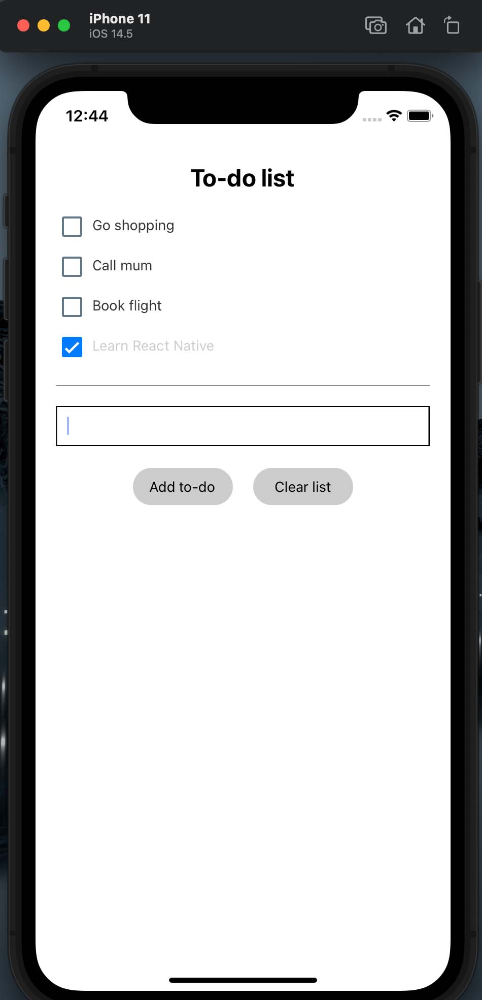

## Class 3 - Styling in native


### Stylesheet
Style properties are inspired by CSS, but they are plain JS objects.

### View

SafeAreaView (iOS)


### flex

`flexDirection` controls the direction in which the children of a node are laid out. This is also referred to as the main axis. 

`justifyContent` describes how to align children within the main axis of their container.

`alignItems` describes how to align children along the cross axis of their container.

With `flexDirection:'column'` (default), to align items horizontally use ` alignItems: 'center'`, and vertically `justifyContent:flex-start/center/space-between/flex-end`


To make a row use
`flexDirection:'row'`

- [Understanding the flexbox layout](https://css-tricks.com/snippets/css/a-guide-to-flexbox/)
- [React Native's Flexbox guide](https://facebook.github.io/react-native/docs/flexbox)

### relative/abslute
These work similar to CSS.


### Images
```<Image source={require('./my-icon.png')} />```    


### Touchable
-[TouchableHighlight](https://reactnative.dev/docs/touchablehighlight)  
-[TouchableOpacity](https://reactnative.dev/docs/touchableopacity)  
-[TouchableWithoutFeedback](https://reactnative.dev/docs/touchablewithoutfeedback)   

### Passing callbacks from parent to child
If you aren't supposed to refer to the parent data in a child component, how is the child supposed to update the parent? You can pass the parent's update function as a property on the child component.


### Resources
-[Great video intro course to React Native](https://www.youtube.com/watch?v=0-S5a0eXPoc&t=3565s&ab_channel=ProgrammingwithMosh)   





### Assignment - React Native
For next class, your assignment is to build your first mobile app:
`Port your react ToDo list to native and add done action`

Your app should feature:

1. A dynamic list of To-Do's.
2. Indication of completion status
3. A button or checkbox to complete each To-Do.
4. An input field to create new To-Do's.
5. A button to clear whole list
5. Any other fancy features you might like (filtering? multiple selection? coloring? emjoi support?)
6. Anything else you dug up in the React Native documentation!


My demo app used [checkboxes](https://docs.expo.dev/versions/v42.0.0/sdk/checkbox/), but you can also use any other type of button

[This boiler](https://github.com/borg/Mobile-Application-Development/tree/master/Classes/examples/TodoBoilerplate
) plate is very minimal, but may be some help.

You can `git pull` the class repo, and then goto the `Classes/examples/TodoBoilerplate` folder and run `yarn install	`. When it is done, run `yarn start` to select your simulator.


[Publish your app with expo](https://docs.expo.io/versions/latest/workflow/publishing/) and post it to the [class 3 issue](https://github.com/borg/Mobile-Application-Development/issues/3) along with your full name.
