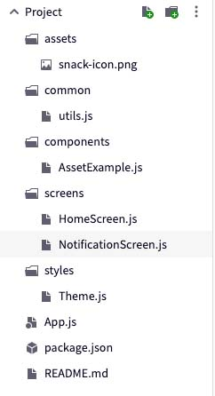

## Class 4A - Navigation & App Structure

Fairly soon your apps will become more complex, and will need some structural organization. Today we are going to look at two ways in which to bring some order to code and files - navigation and file structure.

### Navigation in React Native
Navigation in React Native typically makes use of [React Navigation](https://reactnavigation.org/). (We are using version 6.x today).

This framework offers powerful ways to divide an app into menus and screens.

#### Stack navigator
The most basic navigator is a stack navigator. It puts pages or screens in a stack, with a history.

[Example 1 - Stack navigator](https://snack.expo.dev/@borgus/react-navigation---stack-navigator)


Instead of doing
`<a href="details.html">Go to Details</a>`
we will use 
`onPress={() => navigation.navigate('Details')}` where Details is a screen.


In order to implement navigation in our application, we must define "pages" or "routes".

The term used by the `react-navigation` library is `screens`, and you can think of them
as top-level React components that will serve as the different views of our app, just like multiple `html`
pages in a static website.

Typically, we'll define each screen view in it's own component, the export of which will serve as the corresponding `screen`. Each`screen` needs to be wrapped in a `NavigationContainer`.

```
<NavigationContainer>
        <Stack.Navigator>
          <Stack.Screen name="Home" component={Home} />
          <Stack.Screen name="Conference" component={Conference} options={{ title: 'My bespoke title' }}/>
          <Stack.Screen name="Story" component={Story} />
        </Stack.Navigator>
      </NavigationContainer>
```

Each screen has default options, which can be configured, eg. [changing header](https://reactnavigation.org/docs/headers).

#### Tab navigator
A tab navigator is a common UX paradigm, where the main actions are buttons at the bottom of the screen.

[Example 2: Tab navigator](https://snack.expo.dev/@borgus/react-navigation---tab-navigator-example)


#### Drawer menu
Another common UX paradigm is to use what's called a drawer menu, because it can be thought of as a drawer coming out from one side. Often the UX language used is a hamburger icon. 

[Example 3: Drawer menu](https://snack.expo.dev/@borgus/drawer-menu-example)


#### Installing `react-navigation`
To begin using the navigation library, install the `react-navigation` npm package to your project.
Further installation instructions can be found [on React Navigation](https://reactnavigation.org/docs/getting-started) site.

Install `react-navigation` and additional dependencies by running

```expo install react-native-screens react-native-safe-area-context  @react-navigation/native-stack @react-navigation/bottom-tabs react-native-gesture-handler```

in your project folder


#### The navigator
To actually assign each of these `screen` views to a particular route in our app, such as `/home` or `/settings`,
we need to define a navigator. The navigator is a manager that handles the rendering of the current route and provides us with a functional interface for navigation and transitions, as well as history.

The navigator is wrapped in a container that is the actual root React component in which all our views will be rendered.

```jsx
const Stack = createStackNavigator();
const Drawer = createDrawerNavigator();
const Tab = createBottomTabNavigator();

```


#### Navigation props and actions

The screen views that are rendered by the navigator receive two special `prop` called `props.navigation` and `props.route`.
This object contains all the routing information, history and methods that can be called to navigate between views.

Calling `navigate()` on the `navigation` object and passing a `screen` name will transition the view. We can pass optional properties to give the next view extra context, such as the id of
a contact to view out of a list, or the picture you clicked on to load more content, comments, etc.

```jsx
  render() {
    return (
      <Button title="Go to Jane's profile" onPress={() => this.props.navigation.navigate('Profile', { name: 'Jane' })} />
    );
  }
```

To get the values of these extra parameters, we use the `route.params` method:

```jsx
  render() {
    return (
      <View>
        <Text>Hello, {this.props.route.params.name}</Text>
      </View>
    );
  }
```

[Passing data example](https://snack.expo.dev/@borgus/passing-data-in-navigation)


### File structure

As you can see, keeping all code inside one file isn't very readable. But how should you structure your code? There really isn't a right or wrong answer - my criteria is: "Does it make sense? Would someone that wasn't familiar with the app understand your structure?"

   
Having said that, [this is common structure](https://snack.expo.dev/@borgus/app-structure).

For a more in depth discussion (which applies more to react native than expo), read [this post](https://cheesecakelabs.com/blog/efficient-way-structure-react-native-projects/).


### Resources
- [`react-navigation` documentation](https://reactnavigation.org/docs/getting-started/)

- [Using the Navigator's headers](https://reactnavigation.org/docs/en/headers.html)
