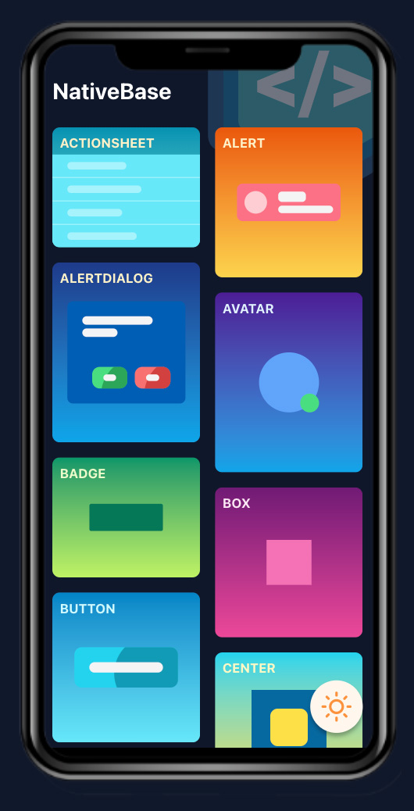
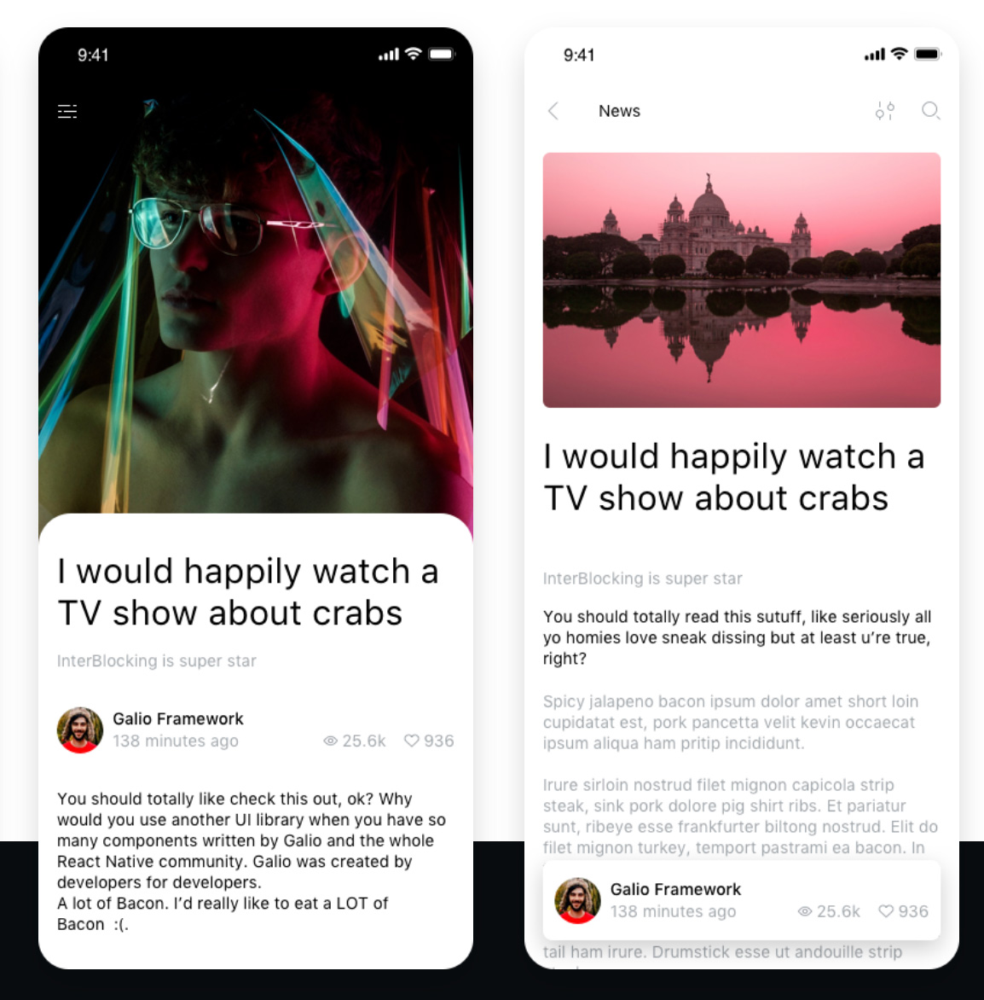
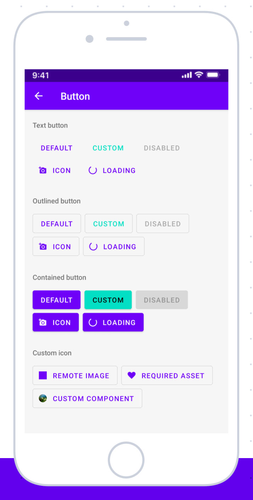

## Class 6B - UX libraries
It is important to know how to build a native app from the ground up. That is why we have focused on things like `View`, `Flatlist` and styling using `flex`. All those things are the essential atoms for building apps, but as you have seen there are other libraries one level up, that are fairly essential as well, such as `react navigation` and some form of `state management`. 


To build an app in an effective way however means that you should also feel free to use some of the quality libraries available for free out there today. Ultimately, just because you can write something from scratch doesn't mean you should. 

Sometimes, if you get a design from a UX designer, you cannot use an available library without having to make a lot of styling changes to it, but for your protoype project you don't have that limitation. 

Here are some of my favorite UX libraries (and sometimes you can combine several of them).

### NativeBase

>Universal Components for React & React Native
NativeBase is an accessible, utility-first component library that helps you build consistent UI across Android, iOS and Web.

[Native Base](https://nativebase.io) has most of the UX widgets you would need, such as action sheets, buttons, alerts etc.

It also has great documentation and snack examples for all components.




### Galio

>Free & Open Source
The Galio Framework is a 100% free, open-source project, licensed under MIT. It will always remain free to use, powered by a huge international community.

>Beautifully designed
Carefully crafted. Ready-made components, typography, and a gorgeous base theme that adapts to each project. You'll be building in style.

>First-class Documentation
Built with real app examples, component demos, guides, and how-to’s to get you up and running with mobile apps faster than ever before.




Here is a [great collection of examples](https://galio.io/built-with-galio).


### Paper
>React Native Paper is a high-quality, standard-compliant Material Design library that has you covered in all major use-cases.

I think you have already used this as the `card` component from the default snack app comes from [this library](https://reactnativepaper.com/).





### Combining 
It is possible to combine different UX libraries. Here is an example from one of my projects (for some reason I cannot get galio to work in snack but it works in react native).

```
import * as React from 'react';
import { View, StyleSheet } from 'react-native';
import Constants from 'expo-constants';
import { NativeBaseProvider, Text, Box ,extendTheme } from 'native-base';
import {GalioProvider} from 'galio-framework';
import Zstack from './components/zstack';
import Switch from './components/switch';
import Deckswiper from './components/deckswiper';

const newColorTheme = {
  brand: {
    900: '#8287af',
    800: '#7c83db',
    700: '#b3bef6',
  },
};
const theme = extendTheme({ colors: newColorTheme });


export default function App() {
  return (
    <NativeBaseProvider theme={theme}>
     <GalioProvider>
      <Box flex={1} bg="#fff" alignItems="center" justifyContent="center">
        <Zstack />
        <Switch/>
      </Box>
      <Deckswiper />
      </GalioProvider>
    </NativeBaseProvider>
  );
}

```
#### A note on name collisions
Often different UX libraries use the same name for common components, such as Text or Button. To distinguish you can rename them at import like so

```
import { Text as NBText} from 'native-base';
import { Text as GText} from 'galio-framework';
```


