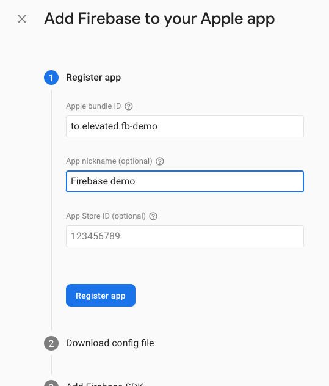
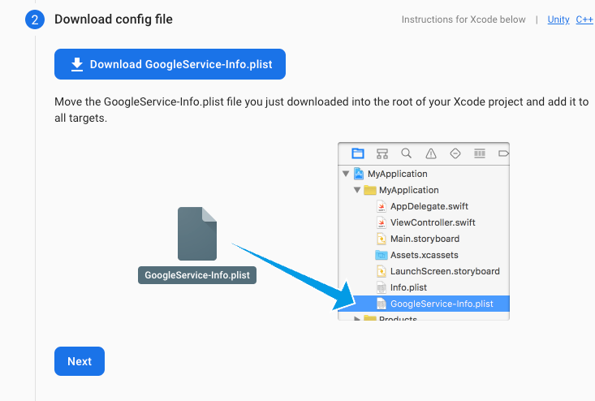
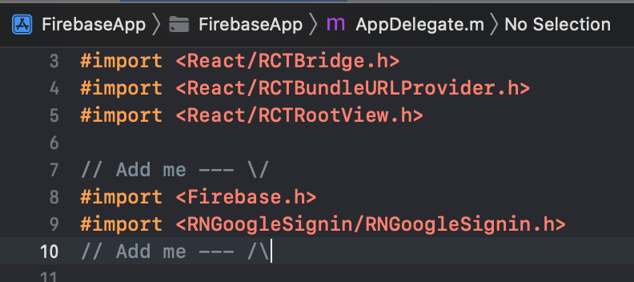
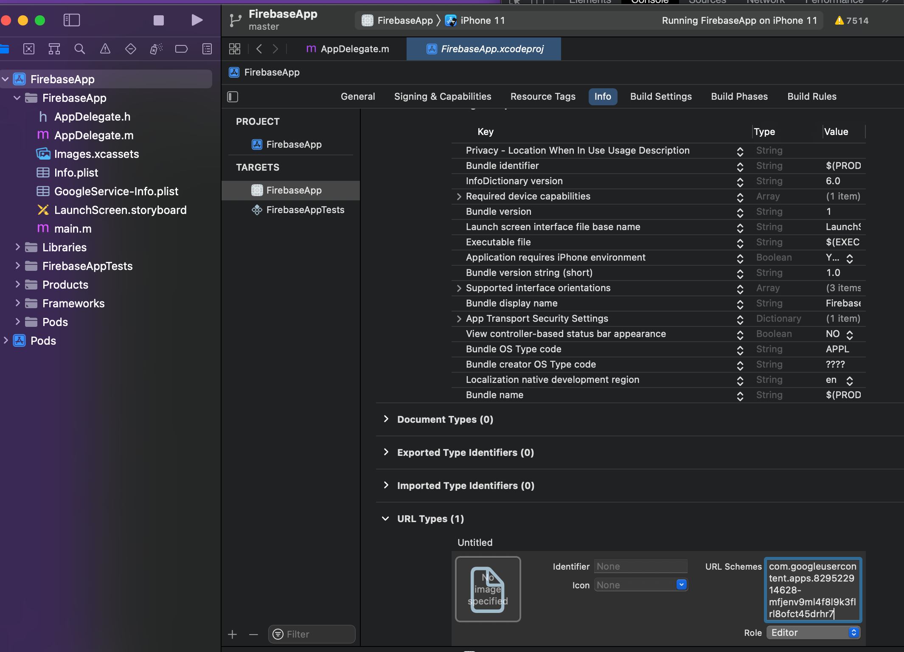
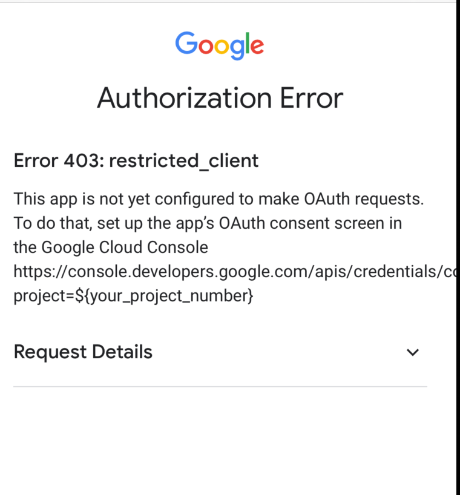
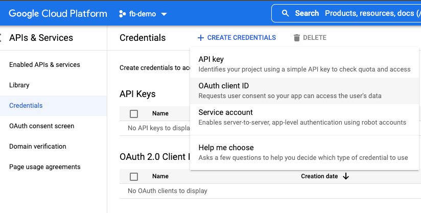
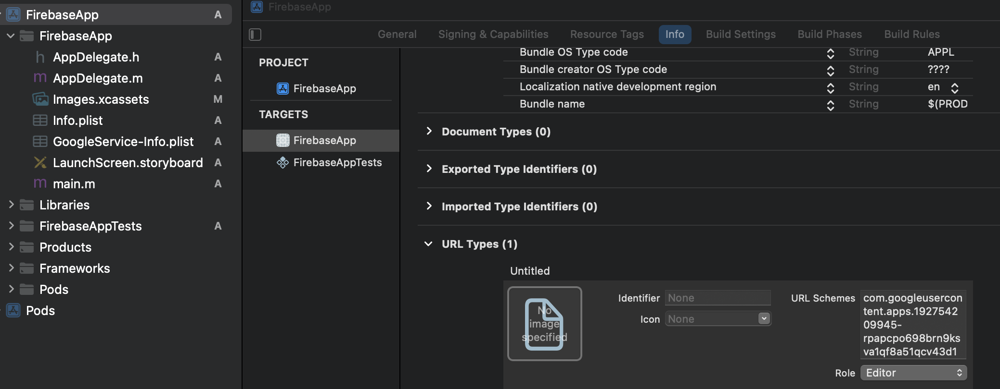

## Class 7A - Firebase App w. Google sign in

Today we are going to look at integrating with Firebase for authentication.

```
npx react-native init FirebaseApp
cd FirebaseApp
yarn add @react-navigation/native @react-navigation/bottom-tabs @react-navigation/drawer @react-navigation/stack react-native-gesture-handler
yarn add react-native-screens react-native-safe-area-context
yarn add @react-native-firebase/app @react-native-firebase/auth
yarn add @react-native-google-signin/google-signin


```


Install cocoa pods. This needs to be done every time (almost) you add a npm package
```
cd ios
pod install
```


Sign up to google developer, and sign into your firebase console
```
https://console.firebase.google.com/
```


Open Xcode by clicking `ios/FirebaseApp.xcworkspace` (note that it's the workspace, not the xcodeproj)


Edit the bundle identifier, using reversed domain format.


Goto `firebase>project settings` and select `register app`.


Download GoogleService0info.plist and add to project as shown.



*SKIP REMAINING APP STEPS! (Don't add swift SDK etc), instead continue the steps in [Configure Firebase with iOS credentials](https://rnfirebase.io/#configure-firebase-with-ios-credentials)*





At the bottom of the `AppDelegate.m`, before `@end` insert   

```
// Linking API
- (BOOL)application:(UIApplication *)app openURL:(NSURL *)url options:(NSDictionary<UIApplicationOpenURLOptionsKey,id> *)options {

  if([RNGoogleSignin application:app openURL:url options:options]){
    return YES;
  }
  return NO;
}

```




Hopefully it builds now and you can run the app in the simulator

```
yarn ios
```


Still not over yet!



To figure this one goto [Google Developer Console](https://console.cloud.google.com/)



Copy the `com.googleusercontent.apps.xxxx` part into the Xcode URL types setting



Copy the `client id` to the config section

```


GoogleSignin.configure({
    scopes: ['https://www.googleapis.com/auth/drive.readonly'], // [Android] what API you want to access on behalf of the user, default is email and profile
    webClientId: "xxxx-cccc.apps.googleusercontent.com", // client ID of type WEB for your server (needed to verify user ID and offline access)
    offlineAccess: true, // if you want to access Google API on behalf of the user FROM YOUR SERVER
    hostedDomain: '', // specifies a hosted domain restriction
    forceCodeForRefreshToken: true, // [Android] related to `serverAuthCode`, read the docs link below *.
    accountName: '', // [Android] specifies an account name on the device that should be used
    iosClientId: "xxxx-cccc.apps.googleusercontent.com", // [iOS] if you want to specify the client ID of type iOS (otherwise, it is taken from GoogleService-Info.plist)
    googleServicePlistPath: '', // [iOS] if you renamed your GoogleService-Info file, new name here, e.g. GoogleService-Info-Staging
    openIdRealm: '', // [iOS] The OpenID2 realm of the home web server. This allows Google to include the user's OpenID Identifier in the OpenID Connect ID token.
    profileImageSize: 120, // [iOS] The desired height (and width) of the profile image. Defaults to 120px
  });

```
`webClientId` and `iosClientId` can (should?) be the same.


The result


### Resources

[React native] (https://reactnative.dev/docs/environment-setup)    
[React Navigation](https://reactnavigation.org/docs/getting-started/)   
[Firebase Console](https://console.firebase.google.com/)   
[Google Developer Console](https://console.cloud.google.com/)
[React Native Firebase](https://rnfirebase.io/)      
[react-native-google-signin](https://github.com/react-native-google-signin/google-signin)
