## Class 7A - Firebase App w. Google sign in

Today we are going to look at integrating with Firebase for authentication.

```
npx react-native init FirebaseApp
cd FirebaseApp
yarn add @react-navigation/native @react-navigation/bottom-tabs @react-navigation/drawer @react-navigation/stack react-native-gesture-handler
yarn add react-native-screens react-native-safe-area-context
yarn add @react-native-firebase/app @react-native-firebase/auth
yarn add @react-native-google-signin/google-signin


```


Install cocoa pods. This needs to be done every time (almost) you add a npm package
```
cd ios
pod install
```


Sign up to google developer, and sign into your firebase console
```
https://console.firebase.google.com/
```


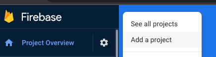


Open Xcode by clicking `ios/FirebaseApp.xcworkspace` (note that it's the workspace, not the xcodeproj)


Edit the bundle identifier, using reversed domain format.
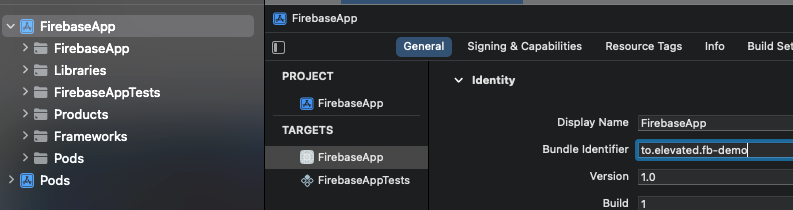


Goto `firebase>project settings` and select `register app`.
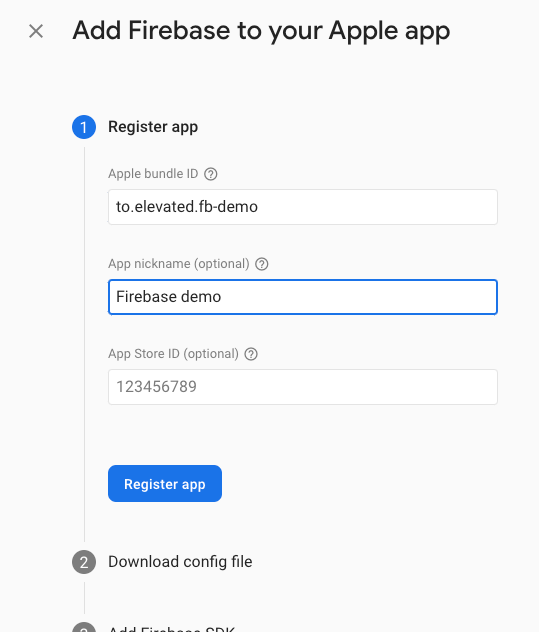

Download GoogleService0info.plist and add to project as shown.

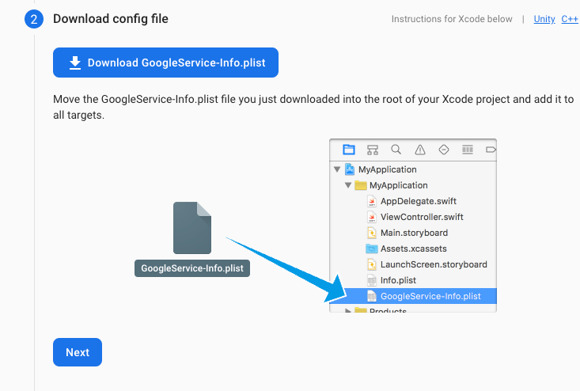

*SKIP REMAINING APP STEPS! (Don't add swift SDK etc), instead continue the steps in [Configure Firebase with iOS credentials](https://rnfirebase.io/#configure-firebase-with-ios-credentials)*


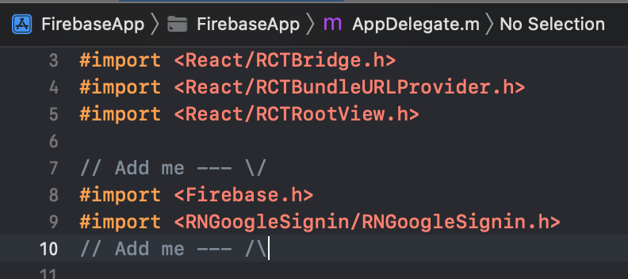


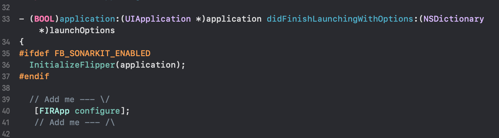


At the bottom of the `AppDelegate.m`, before `@end` insert   

```
// Linking API
- (BOOL)application:(UIApplication *)app openURL:(NSURL *)url options:(NSDictionary<UIApplicationOpenURLOptionsKey,id> *)options {

  if([RNGoogleSignin application:app openURL:url options:options]){
    return YES;
  }
  return NO;
}

```

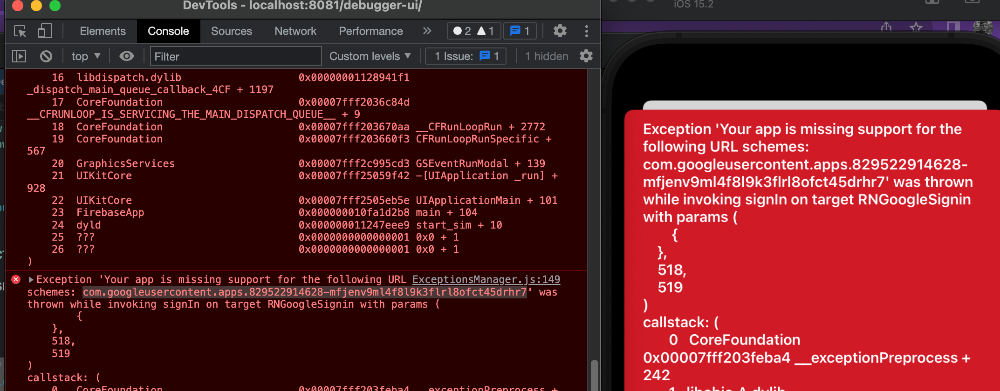

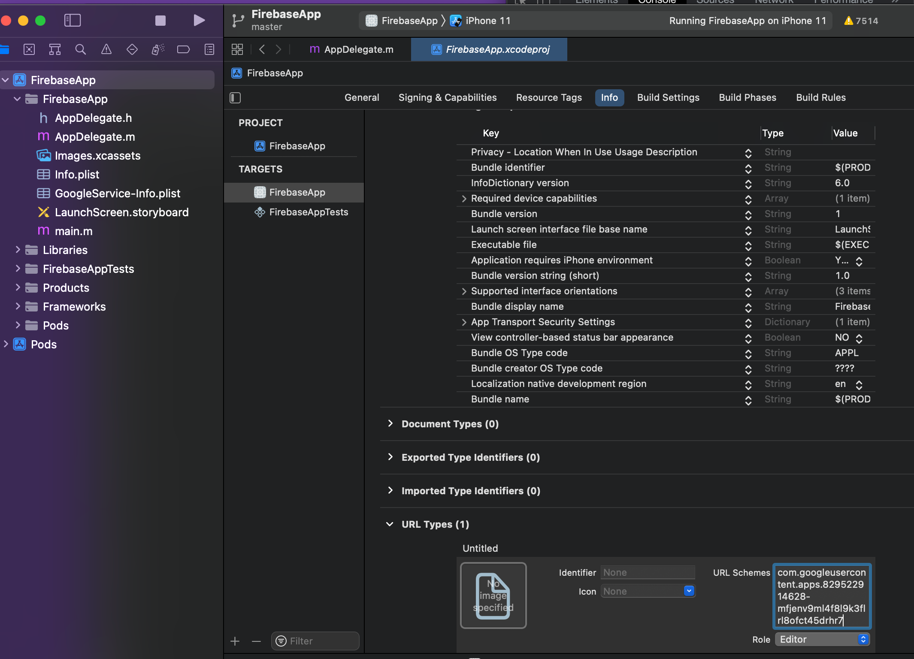

Hopefully it builds now and you can run the app in the simulator

```
yarn ios
```


Still not over yet!

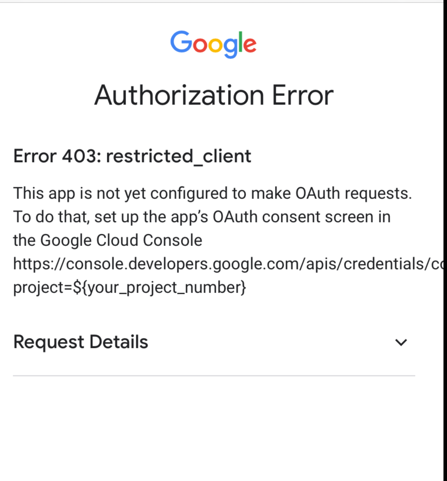

To figure this one goto [Google Developer Console](https://console.cloud.google.com/apis/dashboard)
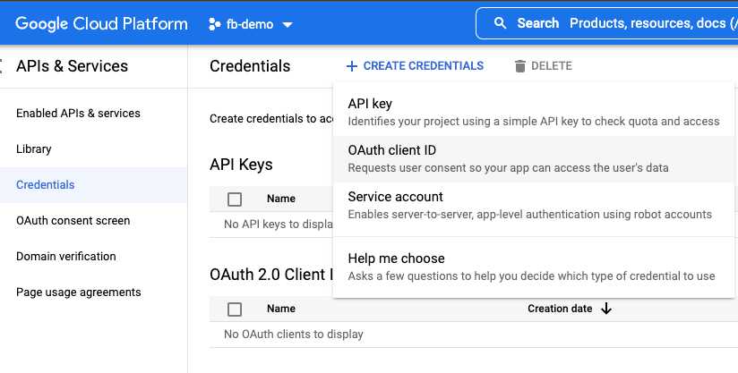

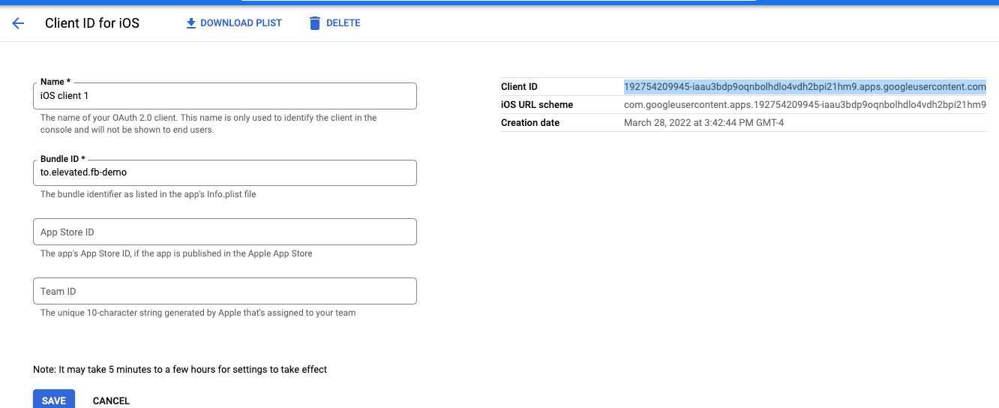

Copy the `com.googleusercontent.apps.xxxx` part into the Xcode URL types setting

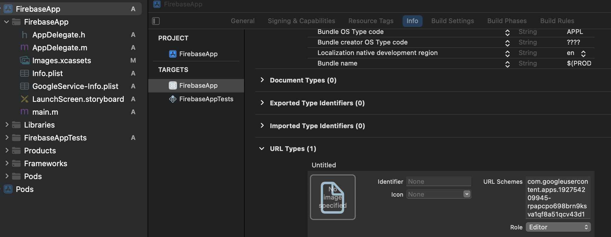

Copy the `client id` to the config section

```


GoogleSignin.configure({
    scopes: ['https://www.googleapis.com/auth/drive.readonly'], // [Android] what API you want to access on behalf of the user, default is email and profile
    webClientId: "xxxx-cccc.apps.googleusercontent.com", // client ID of type WEB for your server (needed to verify user ID and offline access)
    offlineAccess: true, // if you want to access Google API on behalf of the user FROM YOUR SERVER
    hostedDomain: '', // specifies a hosted domain restriction
    forceCodeForRefreshToken: true, // [Android] related to `serverAuthCode`, read the docs link below *.
    accountName: '', // [Android] specifies an account name on the device that should be used
    iosClientId: "xxxx-cccc.apps.googleusercontent.com", // [iOS] if you want to specify the client ID of type iOS (otherwise, it is taken from GoogleService-Info.plist)
    googleServicePlistPath: '', // [iOS] if you renamed your GoogleService-Info file, new name here, e.g. GoogleService-Info-Staging
    openIdRealm: '', // [iOS] The OpenID2 realm of the home web server. This allows Google to include the user's OpenID Identifier in the OpenID Connect ID token.
    profileImageSize: 120, // [iOS] The desired height (and width) of the profile image. Defaults to 120px
  });

```
`webClientId` and `iosClientId` can (should?) be the same.


The result
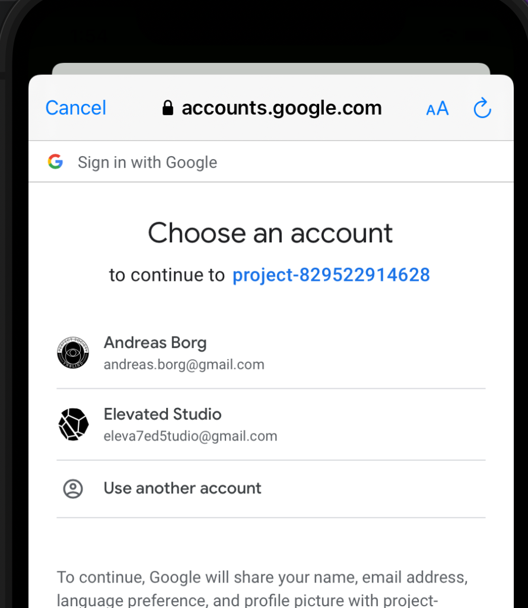

One final step needed to link firebase with google sign in. 

Inside your [firebase app](https://console.firebase.google.com/u/0/project/fir-afdef/authentication/providers), select the Google sign in method, and copy the Client ID from the Google API into firebase.

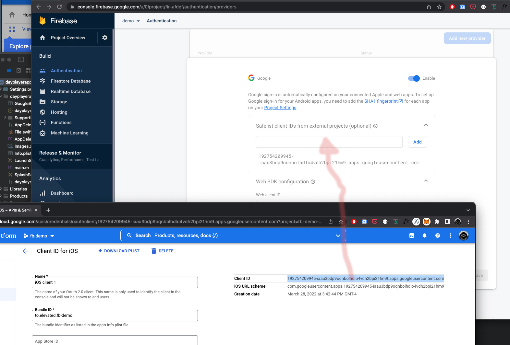


Now the Google Social Sign in should be linked to your Firebase App, and when a user signs in their account is either created or authenticated with firebase.

### Resources

[React native] (https://reactnative.dev/docs/environment-setup)    
[React Navigation](https://reactnavigation.org/docs/getting-started/)   
[Firebase Console](https://console.firebase.google.com/)   
[Google Developer Console](https://console.cloud.google.com/apis/dashboard)   
[React Native Firebase](https://rnfirebase.io/)      
[react-native-google-signin](https://github.com/react-native-google-signin/google-signin)
