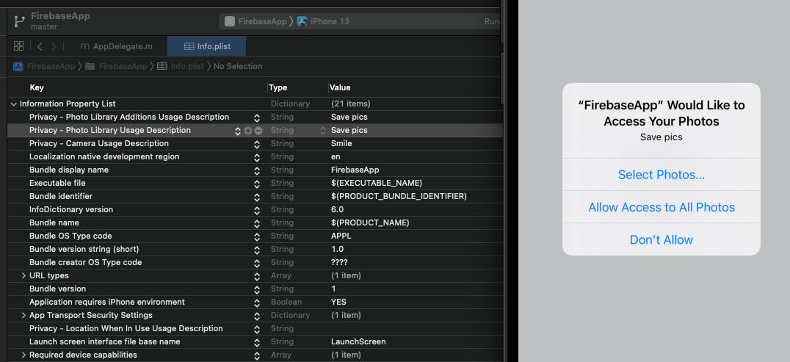
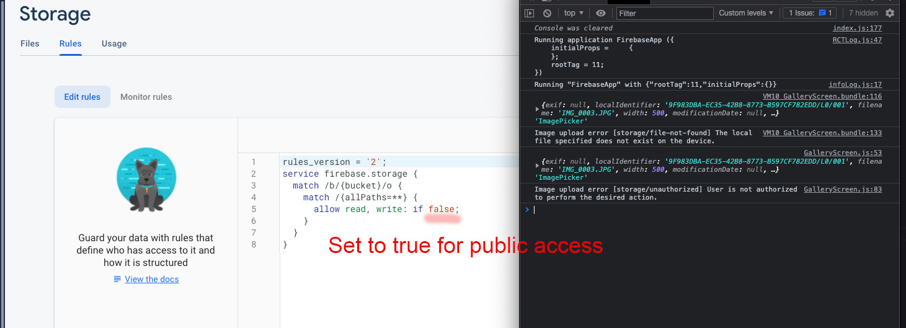
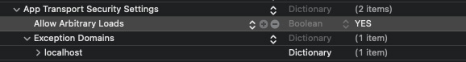

## Class 8A - Firebase continued

Today we are going to look at storing data in firebase. It's a continuation of the [previous class and app](https://github.com/borg/Mobile-Application-Development/blob/master/Classes/Class%207A%20-%20Firebase%20App.md).

```
yarn add react-native-image-crop-picker
# Install the database module
yarn add @react-native-firebase/firestore
# Install the storage module
yarn add @react-native-firebase/storage

#adding checkbox for the todo example
yarn add @react-native-community/checkbox

# If you're developing your app using iOS, run this command
cd ios/ && pod install && cd ..

#Build and launch app
yarn ios
```

If you are follwing along via the [Firebase App repo](https://github.com/borg/Mobile-Application-Development/tree/master/Classes/examples/FirebaseApp) you need to

```
git pull
yarn install
cd ios/ && pod install && cd ..

#Build and launch app
yarn ios
```





### Resources

[Firestore](https://rnfirebase.io/firestore/usage)   
[Image Picker with cropping](https://github.com/ivpusic/react-native-image-crop-picker)  
[Image Picker alternative](https://github.com/react-native-image-picker/react-native-image-picker)   
[Cloud storage](https://rnfirebase.io/storage/usage)    
[Firebase Console](https://console.firebase.google.com/)   
[Google Developer Console](https://console.cloud.google.com/apis/dashboard)   
[React Native Firebase](https://rnfirebase.io/)      

